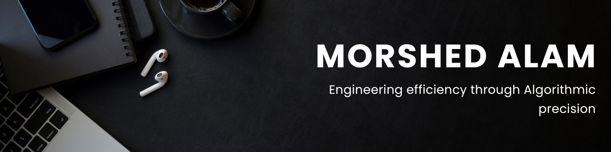

#  Hi there

I'm **Morshed Alam**, a **Software Engineer** with a strong full-stack foundation and a growing focus on **Data Engineering**.

Since 2021, I’ve built web applications, backend systems, APIs, dashboards, and database-driven products using **Python**, **TypeScript/JavaScript**, **React**, **Next.js**, **Node.js**, **Express.js**, **NestJS**, **FastAPI**, **PostgreSQL**, **MongoDB**, **Firebase**, and modern deployment workflows.

My work covers **full-stack product development**, **backend/API architecture**, **database design**, **authentication**, **RBAC**, **real-time/WebSocket communication**, and **system integration**. Through freelance and professional work, I’ve delivered **75+ projects for 45+ clients** while maintaining a **5-star client rating**, with a focus on clean code, reliable delivery, and practical problem-solving.

I’m also building deeper **Data Engineering** capability—the infrastructure side of software that turns raw data into reliable, usable systems. My current focus includes **Python**, **SQL**, **ETL/ELT workflows**, **data cleaning**, **data modeling**, **PostgreSQL**, **Snowflake**, **workflow orchestration**, and scalable **data pipeline foundations**.

I use AI tools like **Claude Code** and **Codex** as engineering accelerators—not shortcuts. I use them to plan architecture, generate/refactor code, test edge cases, improve documentation, and move faster while keeping final validation and technical ownership in my hands.

Outside project work, I practice algorithmic problem-solving on [LeetCode](https://leetcode.com/u/morshedalamdev) and [HackerRank](https://hackerrank.com/profile/morshedalamdev) to sharpen my fundamentals in data structures, algorithms, and computational thinking.

I'm open to **Software Engineer**, **Backend Engineer**, **Full-Stack Engineer**, and **entry-level Data Engineer** opportunities where I can build reliable user-facing systems, backend services, and data pipelines.

---

## Technical Arsenal

- **Software Engineering:** Python, TypeScript/JavaScript, React, Next.js, Node.js, Express.js, NestJS, FastAPI, React Native
- **Data Engineering:** Python, SQL, ETL/ELT workflows, data cleaning, data modeling, Snowflake, data pipeline foundations
- **Databases:** PostgreSQL, MongoDB, Firebase
- **Backend & APIs:** REST, GraphQL, WebSocket APIs, OAuth2, authentication, RBAC, Prisma/TypeORM-style workflows
- **Workflow & Deployment:** Git, GitHub, Vercel, Netlify, CI/CD pipelines, AI-assisted development

---

## Current Focus

- 🌱 Building deeper expertise in **Data Engineering**
- 🧱 Designing scalable backend systems and reliable data models
- ⚙️ Practicing ETL/ELT workflows, SQL analysis, and data pipeline design
- 🧠 Strengthening algorithmic problem-solving through LeetCode and HackerRank
- 🤖 Using AI tools responsibly to accelerate engineering without compromising quality

---

## Find Me On

---

- 👨‍💻 All of my projects are available at [github.com/morshedalamdev?tab=repositories](https://github.com/morshedalamdev?tab=repositories)
- 🌐 Visit my portfolio: [morshedalam.dev](https://morshedalam.dev)
- 📫 Reach me at: **morshedalam.dev@outlook.com**
- 💻 Most used line of code: `console.log("test")`
